# Numerical Solution of Differential Equations — MATLAB

> Classical finite-difference and linear-multistep methods for ODE initial-value problems and second-order PDEs (parabolic, elliptic, hyperbolic). This repository collects the course report: the underlying principles, numerical schemes, key formulas, result figures, and conclusions are presented below. The MATLAB implementations are kept as source files in the `ODE/`, `Parabolic/`, `Elliptic/`, and `Hyperbolic/` directories (not inlined here).

## Overview

| Category | Prototype | Numerical methods | Directory |
|----------|-----------|-------------------|-----------|
| ODE IVP | `y' = f(t, y), y(t0) = y0` | 2nd-order explicit Adams, trapezoidal (implicit Adams), Euler; step-size and scheme error comparison | `ODE/` |
| Parabolic PDE | `u_t = a u_xx + f(x,t)` | Forward (explicit), Crank–Nicolson, upwind; Thomas/chasing for tridiagonal systems | `Parabolic/` |
| Elliptic PDE | Poisson `u_xx + u_yy = f(x,y)` | Five-point stencil with Kronecker-product block matrix; grids `h = 1/64` and `1/128` | `Elliptic/` |
| Hyperbolic PDE | Wave equation `u_tt = a^2 u_xx` | Explicit, implicit, and upwind schemes; block-tridiagonal solver | `Hyperbolic/` |

## Directory Structure

```
numerical-solution-of-differential-equations/
├── ODE/            # ODE initial-value problems (MATLAB sources)
├── Parabolic/      # Parabolic PDEs (MATLAB sources)
├── Elliptic/       # Elliptic PDEs (MATLAB sources)
├── Hyperbolic/     # Hyperbolic PDEs (MATLAB sources)
├── images/         # figures extracted from the report
├── README.md
└── LICENSE
```

## Report — Principles, Methods, Results & Conclusions

The content below follows the original report verbatim: each experiment states the problem, the numerical principle and formulas, the computed results (figures), and the conclusions. Formulas are rendered with LaTeX; the MATLAB code is provided as source files rather than inline.

**实验一 常微分方程数值解法**

# 实验试题

求解下列初值问题的数值解：


要求：选择不同的步长及不同的求解方法（收敛阶不同），对比不同步长下采用同一求解方法时产生的误差，以及同一步长下采用不同求解方法产生的误差。

# 试题分析及求解过程

**不同步长下采用同一求解方法时产生的误差：**采用二阶显式Adams法(1.2)，步长取h=0.1和h=0.05，由实验试题可知，$`f_{k} = 4t_{k}{u_{k}}^{1/2}`$。使用Euler法算出$`u_{1}`$，再通过迭代依次算出$`u_{2}`$到$`u_{20}`$


```math
u_{k + 1} = u_{k} + \frac{h}{2}\left( 3f_{k} - f_{k - 1} \right).
```


接着通过符号计算求解了常微分方程的精确解，将其转换为可调用的函数，并在时间区间内生成1000个等间距点计算对应的数值解，最终绘制精确解曲线（黑色实线），同时添加图例、坐标轴标签和标题。


**同一步长下采用不同求解方法产生的误差：**采用二阶显式Adams法和梯形法(1.3)，步长取h=0.1。方法同上。


```math
u_{k + 1} = u_{k} + \frac{h}{2}\left[ f\left( t_{k},u_{k} \right),f\left( t_{k + 1},u_{k + 1} \right) \right].
```


# 实验结果及分析

**不同步长下采用同一求解方法时产生的误差：**通过图1不难看出，步长为0.05比步长为0.1的显式Adams法求得的数值解更接近精确解曲线。所以可以得出结论步长越小，求得的数值解更精确。通过tictoc记录不同步长下的用时，得到步长为0.1时"历时 0.080657 秒"， 步长为0.05时"历时 0.078674 秒"，运行时长相差不大。

| 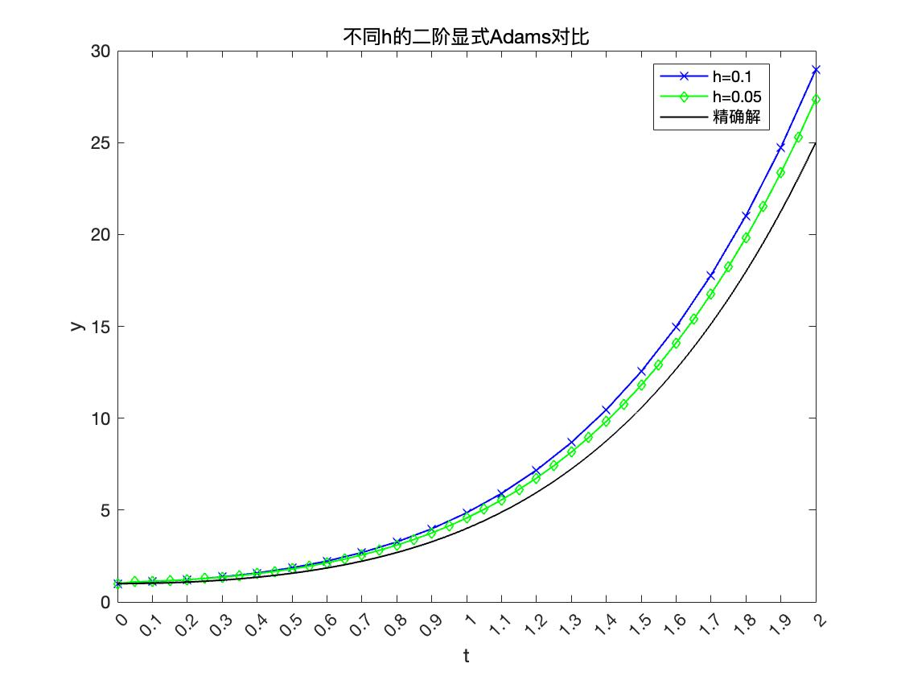 |
|                                                                                                 |
| 图 1‑1 不同步长同一求解方法                                                                     |

**同一步长下采用不同求解方法产生的误差：**通过图2可知，同一步长下，梯形法几乎和精确解重合，而显式Adams法与精确解还有一定距离。通过tictoc记录两种方法下的用时，梯形法"历时 6.401789 秒"， 显式Adams法"历时 0.003981 秒"。由此可见，梯形法比显式Adams法精确度更高，但用时更久。

| 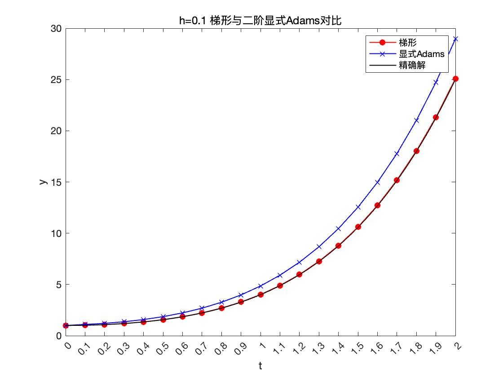 |
|                                                                                                |
| 图 1‑2 同一步长不同求解方法                                                                    |

# 总结

实验结果表明，梯形法虽然在精度上显著优于显式Adams法，但其计算成本也更高，这表明在实际应用中，需要根据问题的具体需求选择合适的数值方法。对于对精度要求极高的问题，梯形法是更好的选择；而对于对效率要求较高的问题，显式Adams法则更为合适。此外，步长的选择对数值解的精度有直接影响，步长越小，数值解越接近精确解，但步长的减小并不总是导致计算时间的增加，这可能与实验环境或具体实现有关。通过tictoc记录运行时间，验证了不同方法和步长下的计算效率，这为数值方法的选择提供了实际依据。总体而言，本次实验不仅加深了我对数值方法的理解，还提供了在实际应用中选择和优化数值方法的案例。

**实验二 椭圆型方程的数值解法**

# 实验试题

求下列边值问题的数值解：


其精确解为.

要求：取步长 , 作五点差分格式。

# 试题分析及求解过程

对于二维Poisson方程的Dirichlet边值问题


```math
\begin{cases}
 - \Delta u = f(x,y),\ \ \ (x,y) \in \Omega, 
u = \varphi(x,y),\ \ \ (x,y) \in \Gamma.
\end{cases}
```


在内节点$`(x_{i},y_{i})`$处用二阶中心差商$`u_{xx},u_{yy}`$，并引入差分算子


```math
\mathrm{\Delta}_{h}u_{i,j} = \frac{u_{i - 1,j} - 2u_{i,j} + u_{i + 1,j}}{h_{1}^{2}} + \frac{u_{i,j - 1} - 2u_{i,j} + u_{i,j + 1}}{h_{2}^{2}},
```


可用差分方程(2.4)求解


```math
\begin{cases}
 - \mathrm{\Delta}_{h}u_{i,j} = f\left( x_{i},y_{j} \right),\ \ \ (i,j) \in \omega, 
u_{i,j} = \varphi\left( x_{i},y_{j} \right),\ \ \ (i,j) \in \gamma.
\end{cases}
```


将（2.3）和（2.4）改写为未知量的线性方程组

```math
- \frac{1}{h_{2}^{2}}u_{i,j - 1} + \left[ - \frac{1}{h_{1}^{2}}u_{i - 1,j} + \left( \frac{2}{h_{1}^{2}} + \frac{2}{h_{2}^{2}} \right)u_{i,j} - \frac{1}{h_{1}^{2}}u_{i + 1,j} \right] - \frac{1}{h_{2}^{2}}u_{i,j + 1} = f\left( x_{i},y_{j} \right),
```
```math
(2.5)
```
|                                                                                                                                                                                                                                                                       |           |
```math
1 \leq i \leq m - 1,\ 1 \leq j \leq n - 1.
```
                                                                                                                                                                                                                        |           |

记


```math
u_{j} = \begin{bmatrix}
u_{1,j} 
u_{2,j} 
\begin{matrix}
 \vdots 
\begin{matrix}
u_{m - 2,j} 
u_{m - 1,j}
\end{matrix}
\end{matrix}
\end{bmatrix},\ \ f_{j} = \begin{bmatrix}
f_{1,j} + \frac{1}{h_{1}^{2}}\varphi_{0,j} 
f_{2,j}\ \ \ \ \ \ \ \ \ \ \ \ \ \ \ \ \ \  
\begin{matrix}
 \vdots \ \ \ \ \ \ \ \ \ \ \ \ \ \ \ \ \ \  
\begin{matrix}
f_{m - 2,j}\ \ \ \ \ \ \ \ \ \ \ \ \ \ \ \ \ \ \  
f_{m - 1,j} + \frac{1}{h_{1}^{2}}\varphi_{m,j}
\end{matrix}
\end{matrix}
\end{bmatrix},
```


```math
\begin{matrix}
D = diag\{ - \frac{1}{h_{2}^{2}},..., - \frac{1}{h_{2}^{2}}\}, 
C = \begin{bmatrix}
\frac{2}{h_{1}^{2}} + \frac{2}{h_{2}^{2}}\ \ \ \  - \frac{1}{h_{1}^{2}}\ \ \ \ \ \ \ \ \ \ \ \ \ \ \ \ \ \ \ \ \ \ \ \ \ \ \ \ \ \ \ \ \ \ \ \ \ \ \ \ \ \ \ \ \ \ \ \ \ \ \ \ \ \ \ \ \ \ \ \ \  
 - \frac{1}{h_{1}^{2}}\ \ \ \ \ \ \frac{2}{h_{1}^{2}} + \frac{2}{h_{2}^{2}}\ \ \ \  - \frac{1}{h_{1}^{2}}\ \ \ \ \ \ \ \ \ \ \ \ \ \ \ \ \ \ \ \ \ \ \ \ \ \ \ \ \ \ \ \ \ \ \ \ \ \ \ \ \ \ \  
\begin{matrix}
\ \ \ \ \ \ \  \ddots \ \ \ \ \ \ \ \ \ \ \ \  \ddots \ \ \ \ \ \ \ \ \ \  \ddots \ \ \ \ \ \ \ \ \ \ \ \ \ \ \ \ \ \  
\ \ \ \ \ \ \ \ \ \ \ \ \ \ \ \ \ \ \ \ \ \ \ \ \ \ \ \ \ \ \ \ \ \ \ \ \ \ \ \ \ \ \ \ \  - \frac{1}{h_{1}^{2}}\ \ \ \ \ \ \frac{2}{h_{1}^{2}} + \frac{2}{h_{2}^{2}}\ \ \ \  - \frac{1}{h_{1}^{2}} 
\ \ \ \ \ \ \ \ \ \ \ \ \ \ \ \ \ \ \ \ \ \ \ \ \ \ \ \ \ \ \ \ \ \ \ \ \ \ \ \ \ \ \ \ \ \ \ \ \ \ \ \ \ \ \ \ \ \ \ \ \ \ \ \ \ \ \ \  - \frac{1}{h_{1}^{2}}\ \ \ \ \ \frac{2}{h_{1}^{2}} + \frac{2}{h_{2}^{2}}
\end{matrix}
\end{bmatrix}
\end{matrix}.
```


则差分方程可以写成


```math
Du_{j - 1} + Cu_{j} + Du_{j + 1} = f_{j},\ \ 1 \leq j \leq n - 1.
```


进一步可以写成


```math
\begin{bmatrix}
C\ \ \ D\ \ \ \ \ \ \ \ \ \ \ \ \ \ \ \ \ \ \ \ \ \ \  
D\ \ \ C\ \ \ D\ \ \ \ \ \ \ \ \ \ \ \ \ \ \ \ \  
\begin{matrix}
\ \ \ \ \ \ \  \ddots \ \ \  \ddots \ \ \  \ddots 
\ \ \ \ \ \ \ \ \ \ \ \ \ \ \ \ \ \ \ D\ \ \ C\ \ \ D 
\ \ \ \ \ \ \ \ \ \ \ \ \ \ \ \ \ \ \ \ \ \ \ \ \ D\ \ \ C
\end{matrix}
\end{bmatrix}\begin{bmatrix}
u_{1} 
u_{2} 
\begin{matrix}
 \vdots 
u_{n - 2} 
u_{n - 1}
\end{matrix}
\end{bmatrix} = \begin{bmatrix}
f_{1} - Du_{0} 
f_{2}\ \ \ \ \ \ \ \ \  
\begin{matrix}
 \vdots \ \ \ \ \ \ \ \ \  
f_{n - 2}\ \ \ \ \ \ \ \ \  
f_{n - 1} - Du_{n}
\end{matrix}
\end{bmatrix}.
```


由公式2.1可知，边界条件都为0，所以$`\frac{1}{h_{1}^{2}}\varphi_{i,j}`$和$`Du_{j}`$都为0。编写程序时，先构造由C和D构成的分块系数矩阵，再通过网格节点数依次计算Poisson方程右端项的值，构造f向量。用矩阵求逆算出内一列节点u的值，重新排列u，并在周围加一圈外节点，获得网格函数的矩阵。使用meshgrid函数绘制三维图像。同时把网格矩阵降维成一维向量，和精确解绘制在同一张二维图像中，进行对比。

程序只需修改步长（n的倒数），便可获得不同步长下的五点差分格式。以下以步长为1/64作为示例。


最后，绘制精确解三维图像，为后续对比做准备。


# 实验结果及分析

**3.1 步长=1/64的五点差分格式**

| 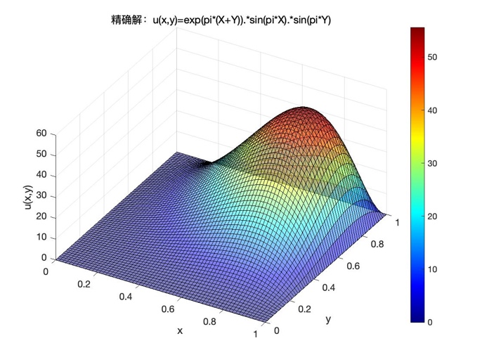 | 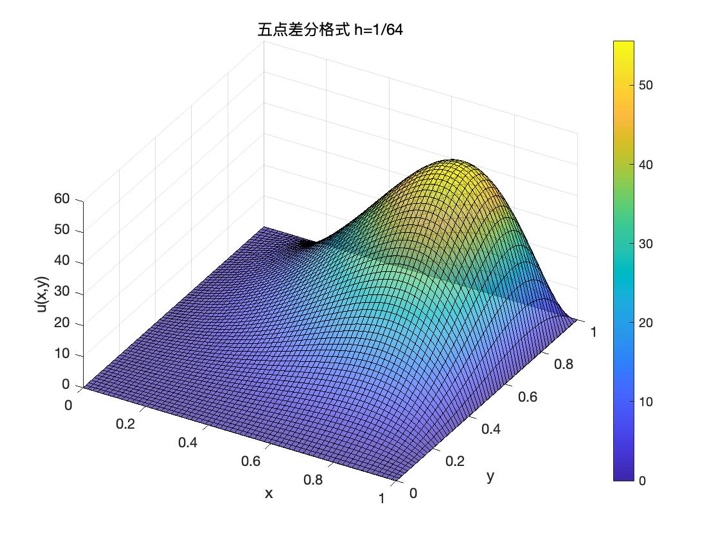 |
|                                                                                                  |                                                                                                  |
| 图 2‑3精确解三维图像                                                                             | 图 2‑4 步长为1/64的五点差分格式三维图像                                                          |

图2-3和图2-4分别为该Poisson方程的精确解和步长为1/64的数值解，三维图像可以看清整体的趋势，但不便于比较精确解和数值解。下图将精确解和数值解降维到二维平面进行对比。

| 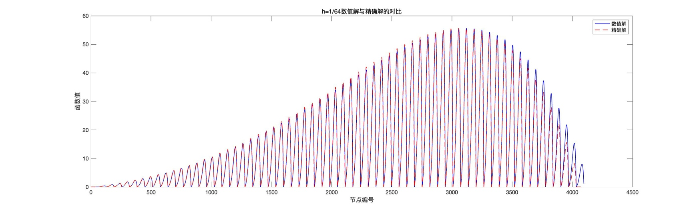 |
|                                                                                                  |
| 图 2‑5 步长为1/64的数值解与精确解对比                                                            |

数值解总体近似与精确解，整体趋势一致。下面将局部放大观察，数值解在前半部分（3000节点编号）之前的波动幅度更小，后半部分波动更大，峰值更高。

  ------------------------------------------------------------------------------------------------------------------------------------------------------------------------------------------------------
  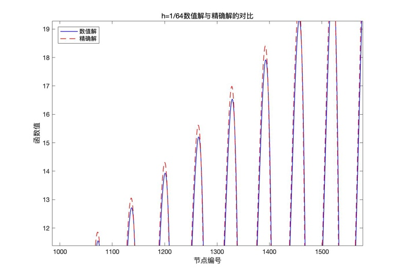   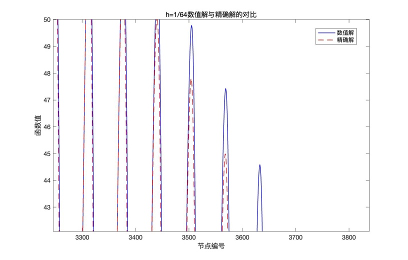
  -------------------------------------------------------------------------------------------------- ---------------------------------------------------------------------------------------------------

  ------------------------------------------------------------------------------------------------------------------------------------------------------------------------------------------------------

  : 图 2‑6 步长为1/64的数值解与精确解对比（局部）

**3.2 步长=1/128的五点差分格式**

首先绘制该补偿下的五点差分格式三维图像，观察到与精确解的图像近似，步长更小，网格更密集，说明该数值解计算正确。

| 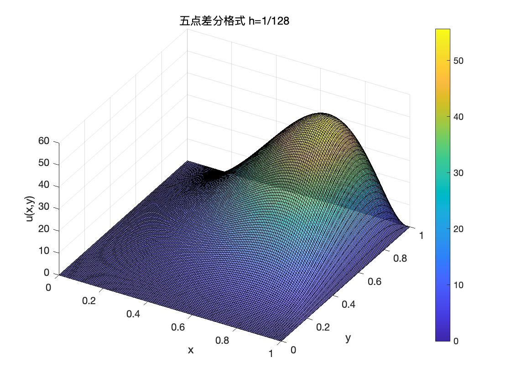 |
|                                                                                                 |
| 图 2‑7步长为1/128的五点差分格式三维图像                                                         |

观察图2-8和图2-3，发现步长为1/128相较于1/64时，数值解的波动幅度更接近精确解，误差明显减小，尤其是在高频区域。数值解的峰值与精确解的差距明显减小。数值解的波动性与精确解更加一致，误差主要集中在某些局部区域。数值解的稳定性显著提高，波动幅度更加平滑，与精确解的吻合度更高。

| 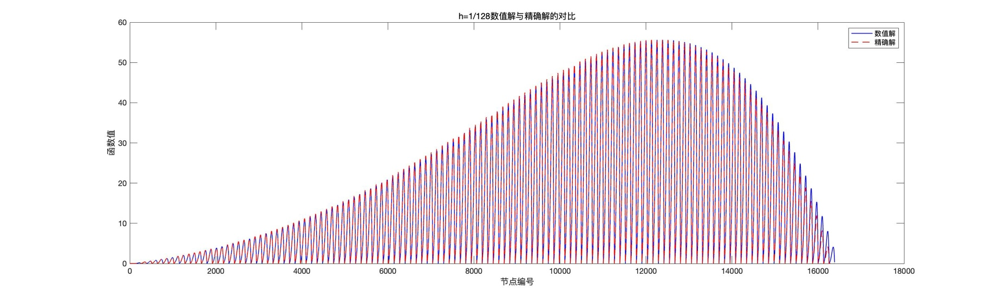 |
|                                                                                                   |
| 图 2‑8步长为1/128的数值解与精确解对比                                                             |

在局部区域（如节点编号 4900 到 5900 和 14500 到 15500），数值解的波动幅度与精确解相比有明显的差异。数值解在前半部分之前的波动幅度更小，后半部分波动更大，峰值更高。

  -----------------------------------------------------------------------------------------------------------------------------------------------------------------------------------------------------
  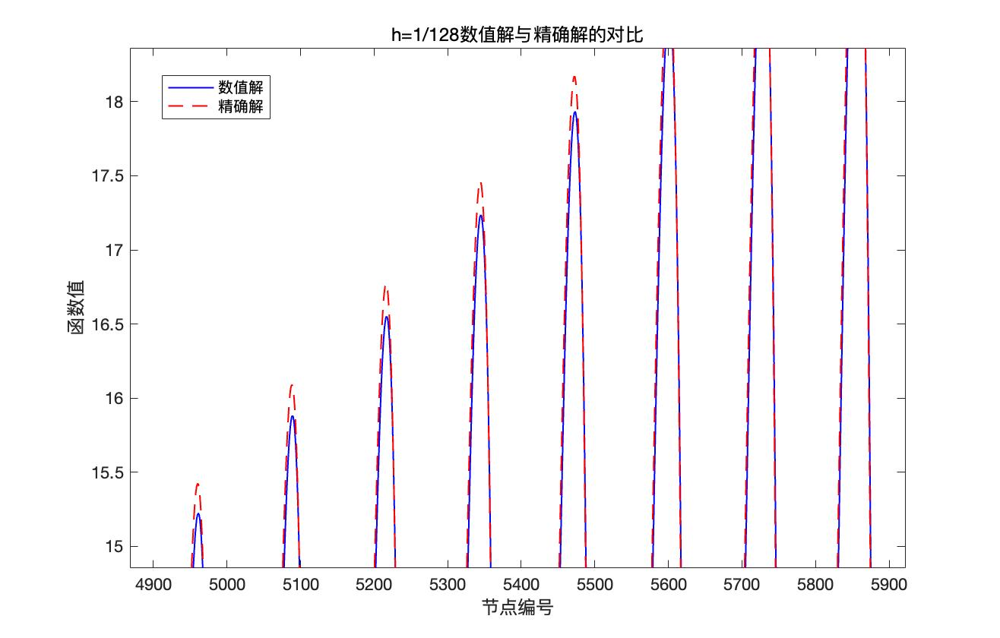   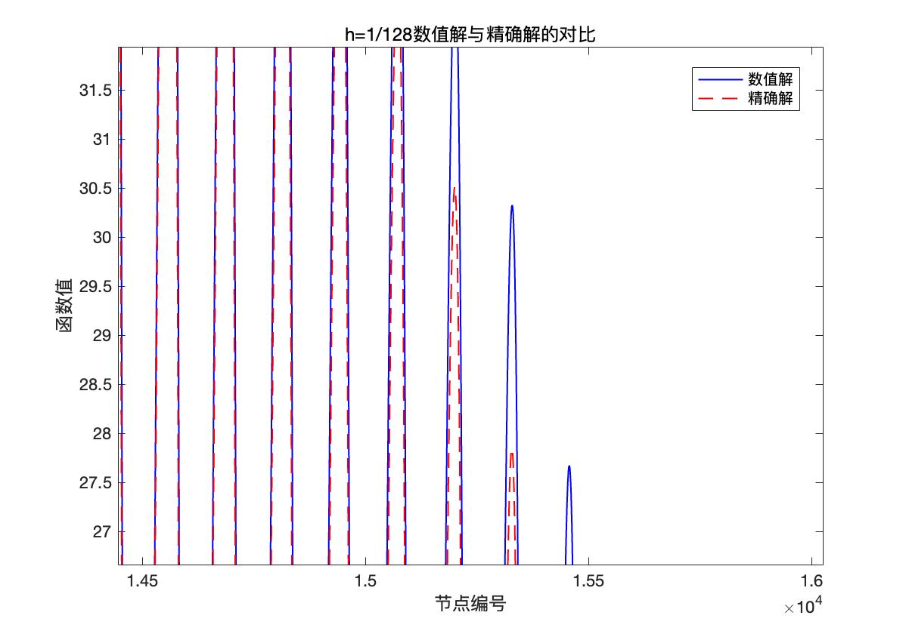
  ------------------------------------------------------------------------------------------------- ---------------------------------------------------------------------------------------------------

  -----------------------------------------------------------------------------------------------------------------------------------------------------------------------------------------------------

  : 图 2‑9 步长为1/128的数值解与精确解对比（局部）

# 总结

1.  **步长的影响**：

步长对数值解的精度有显著影响。较小的步长（如1/128）可以显著减小数值解与精确解之间的误差，提高数值解的精度和稳定性。

较大的步长（如1/64）可能导致数值解在高频区域出现较大的误差和不稳定性。

2.  **数值方法的有效性**：

五点差分格式在求解二维Poisson方程时是有效的，但其精度依赖于步长的选择。减小步长可以提高解的精度，但会增加计算成本。

3.  **误差分析**：

数值解的误差主要集中在前段和后端，这可能是由于数值方法的局部截断误差的不稳定性导致的。

相位误差和幅度误差在局部区域更为明显，尤其是在高频变化区域。

通过实验，验证了五点差分格式在求解二维Poisson方程时的有效性，并分析了不同步长对数值解精度的影响。实验结果表明，减小步长可以显著提高数值解的精度和稳定性，但会增加计算成本。

**实验三 抛物型方程的数值解法**

# 实验试题

分别用向前差分格式和Grank-Nicolson格式求下列一维抛物方程的初边值问题的数值解：


其精确解为.

要求：网格分别取两组以及 比较不同数值方法之间的差异。

# 试题分析及求解过程

**2.1 向前差分格式**

对于一维抛物方程的初边值问题


```math
\begin{cases}
\frac{\partial u}{\partial t} = a\frac{\partial^{2}u}{\partial x^{2}} + f(x,t),\ \ 0 < x < 1,t > 0, 
u(x,0) = \varphi(x),\ \ 0 < x < 1, 
u(0,t) = \alpha(t),u(1,t) = \beta(t),\ \ 0 \leq t \leq T.
\end{cases}
```


将求解区域


```math
G = \left\{ (x,y) \mid 0 \leq x \leq 1,0 \leq t \leq T \right\},
```


作剖分。将区间$`[ 0,l]`$作$`m`$等分，将区间$`[ 0,T]`$作n等分，记


```math
\begin{aligned}
h = \frac{1}{m},\ \ x_{i} = ih,\ (0 \leq i \leq m), \\
\tau = \frac{T}{n},\ \ t_{k} = k\tau,(0 \leq k \leq n),
\end{aligned}
```


分别称$`h`$和$`\tau`$为空间步长和时间步长。

将（3.3）作向前差分格式：


```math
\begin{cases}
\frac{u_{i,k + 1} - u_{i,k}}{\tau} = a\frac{u_{i - 1,k} - 2u_{i,k} + u_{i + 1,k}}{h^{2}} + f_{i,k},\  
u_{i,0} = \varphi\left( x_{i} \right), 
u_{0,k} = \alpha\left( t_{k} \right),\ \ u_{m,k} = \beta\left( t_{k} \right).
\end{cases}
```


其中$`i = 1,2,\ldots,m - 1,\ k = 1,2,\ldots,n.`$

令$`r = a\frac{\tau}{h^{2}}`$，将（3.5）改写为线性方程组


```math
\begin{aligned}
u_{i,k + 1} = ru_{i - 1,k} + (1 - 2r)u_{i,k} + ru_{i + 1,k} + f_{i,k}, \\
1 \leq i \leq m - 1,\ \ 1 \leq k \leq n - 1.
\end{aligned}
```


记


```math
u_{k} = \begin{bmatrix}
u_{1,k} 
u_{2,k} 
\begin{matrix}
 \vdots 
\begin{matrix}
u_{m - 2,k} 
u_{m - 1,k}
\end{matrix}
\end{matrix}
\end{bmatrix},\ \ f_{k} = \begin{bmatrix}
\tau f_{1,k} + ru_{0,k} 
\tau f_{2,k}\ \ \ \ \ \ \ \ \ \ \ \ \ \ \ \ \ \  
\begin{matrix}
 \vdots \ \ \ \ \ \ \ \ \ \ \ \ \ \ \ \ \ \  
\begin{matrix}
{\tau f}_{m - 2,k}\ \ \ \ \ \ \ \ \ \ \ \ \ \ \ \ \ \ \  
\tau f_{m - 1,k} + r\varphi_{m,k}
\end{matrix}
\end{matrix}
\end{bmatrix},
```


```math
R = \begin{bmatrix}
1 - 2r\ \ \ \ r\ \ \ \ \ \ \ \ \ \ \ \ \ \ \ \ \ \ \ \ \ \ \ \ \ \ \ \ \ \ \ \ \ \ \ \ \ \ \ \ \ \ \ \ \ \ \ \ \ \ \ \ \ \ \ \ \ \ \ \  
r\ \ \ \ \ 1 - 2r\ \ \ \ r\ \ \ \ \ \ \ \ \ \ \ \ \ \ \ \ \ \ \ \ \ \ \ \ \ \ \ \ \ \ \ \ \ \ \ \ \ \ \ \ \ \  
\begin{matrix}
\ \ \ \ \ \ \ \ \ \ \ \ \ \ \  \ddots \ \ \ \ \ \ \ \ \ \ \ \  \ddots \ \ \ \ \ \ \ \ \ \  \ddots \ \ \ \ \ \ \ \ \ \ \ \ \ \ \ \ \ \  
\ \ \ \ \ \ \ \ \ \ \ \ \ \ \ \ \ \ \ \ \ \ \ \ \ \ \ \ \ \ \ \ \ \ \ \ \ \ \ \ \ \ \ \ \ r\ \ \ \ \ 1 - 2r\ \ \ \ r 
\ \ \ \ \ \ \ \ \ \ \ \ \ \ \ \ \ \ \ \ \ \ \ \ \ \ \ \ \ \ \ \ \ \ \ \ \ \ \ \ \ \ \ \ \ \ \ \ \ \ \ \ \ \ \ \ \ \ \ \ \ \ \ \ r\ \ \ \ \ 1 - 2r
\end{matrix}
\end{bmatrix}.
```


则（3.6）可以写成


```math
Ru_{k} - Iu_{k + 1} = - f_{k},\ \ 1 \leq k \leq n - 1.
```


其中$`I`$表示单位矩阵，进一步写成矩阵形式：


```math
\begin{bmatrix}
 - I\ \ \ \ \ \ \ \ \ \ \ \ \ \ \ \ \ \ \ \ \ \ \ \ \ \ \ \  
R\  - I\ \ \ \ \ \ \ \ \ \ \ \ \ \ \ \ \ \ \ \  
\begin{matrix}
 \ddots \ \ \  \ddots \ \ \  \ddots 
\ \ \ \ \ \ \ \ \ \ \ \ \ \ \ \ \ \ \ \ \  - I\ \ \ \ \  
\ \ \ \ \ \ \ \ \ \ \ \ \ \ \ \ \ \ \ \ \ \ \ \ \ R\ \  - I
\end{matrix}
\end{bmatrix}\begin{bmatrix}
u_{1} 
u_{2} 
\begin{matrix}
 \vdots 
u_{n - 1} 
u_{n}
\end{matrix}
\end{bmatrix} = \begin{bmatrix}
 - f_{1} - Ru_{0} 
{- f}_{2}\ \ \ \ \ \ \ \ \ \ \ \ \  
\begin{matrix}
 \vdots \ \ \ \ \ \ \ \ \  
 - f_{n - 1}\ \ \ \ \ \ \ \ \  
{- f}_{n}\ \ \ \ \ \ \ \ \ \ \ \ 
\end{matrix}
\end{bmatrix}.
```


先构造$`R`$矩阵，接着构造由$`R`$和单位阵组成的分块系数矩阵。根据（3.1）可知，$`u_{0} = \cos(\pi ih),\ 1 \leq i \leq m - 1`$，因此由$`f_{k}`$构成的方程右端项矩阵最后还需添加初始条件。最后，矩阵求逆算出节点$`u`$、精确解与数值解对比、网格函数可视化这部分思路与实验二类似，可以沿用。

以下以作为示例。


绘制精确解的三维图像，以验证数值解的准确性：


2.  **Grank-Nicolson格式**

将（3.2）作Grank-Nicolson格式：


```math
\begin{cases}
\frac{u_{i,k + 1} - u_{i,k}}{\tau} = \frac{a}{2}\left[ \frac{u_{i - 1,k + 1} - 2u_{i,k + 1} + u_{i + 1,k + 1}}{h^{2}} + \frac{u_{i - 1,k} - 2u_{i,k} + u_{i + 1,k}}{h^{2}} \right] 
 + \frac{1}{2}[ f\left( x_{i},t_{k} \right) + f\left( x_{i},t_{k + 1} \right)],\  
u_{i,0} = \varphi\left( x_{i} \right), 
u_{0,k} = \alpha\left( t_{k} \right),\ \ u_{m,k} = \beta\left( t_{k} \right).
\end{cases}
```


其中$`i = 1,2,\ldots,m - 1,\ k = 1,2,\ldots,n.`$

令$`r = a\frac{\tau}{h^{2}}`$，将（3.11）改写为线性方程组


```math
\begin{aligned}
- \frac{r}{2}u_{i - 1,k + 1} + (1 + r)u_{i,k + 1} - \frac{r}{2}u_{i + 1,k + 1} = \\
\frac{r}{2}u_{i - 1,k} + (1 - r)u_{i,k} + \frac{r}{2}u_{i + 1,k} + \frac{\tau}{2}[ f_{i,k + 1} + f_{i,k}], \\
1 \leq i \leq m - 1,\ \ 1 \leq k \leq n - 1.
\end{aligned}
```


记


```math
u_{k} = \begin{bmatrix}
u_{1,k} 
u_{2,k} 
\begin{matrix}
 \vdots 
\begin{matrix}
u_{m - 2,k} 
u_{m - 1,k}
\end{matrix}
\end{matrix}
\end{bmatrix},\ \ f_{k} = \begin{bmatrix}
{\frac{\tau}{2}(f}_{1,k} + f_{1,k + 1}) + \frac{r}{2}{(\varphi}_{0,k} + \varphi_{0,k + 1})\ \ \ \ \ \ \ \ \ \ \ \ \ \ \ \ \ \ \ \ \ \  
\frac{\tau}{2}{(f}_{2,k} + f_{2,k + 1})\ \ \ \ \ \ \ \ \ \ \ \ \ \ \ \ \ \ \ \ \ \ \ \ \ \ \ \ \ \ \ \ \ \ \ \ \ \ \ \ \ \ \ \ \ \ \ \ \ \ \ \ \ \ \ \ \ \ \  
\begin{matrix}
 \vdots \ \ \ \ \ \ \ \ \ \ \ \ \ \ \ \ \ \ \ \ \ \ \ \ \ \ \ \ \ \ \ \ \ \ \ \ \ \ \ \ \ \ \ \ \ \ \ \ \ \ \ \ \ \ \ \ \  
\begin{matrix}
{\frac{\tau}{2}(f}_{m - 2,k} + f_{m - 2,k + 1})\ \ \ \ \ \ \ \ \ \ \ \ \ \ \ \ \ \ \ \ \ \ \ \ \ \ \ \ \ \ \ \ \ \ \ \ \ \ \ \ \ \ \ \ \ \ \ \ \  
\frac{\tau}{2}{(f}_{m - 1,k} + f_{m - 1,k + 1}) + \frac{r}{2}{(\varphi}_{m - 1,k} + \varphi_{m - 1,k + 1})
\end{matrix}
\end{matrix}
\end{bmatrix},
```


```math
R_{1} = \begin{bmatrix}
1 + r\ \ \  - \frac{r}{2}\ \ \ \ \ \ \ \ \ \ \ \ \ \ \ \ \ \ \ \ \ \ \ \ \ \ \ \ \ \ \ \ \ \ \ \ \ \ \ \ \ \ \ \ \ \ \ \ \ \ \ \ \ \ \ \ \ \ \ \  
 - \frac{r}{2}\ \ \ \ \ 1 + r\ \ \ \  - \frac{r}{2}\ \ \ \ \ \ \ \ \ \ \ \ \ \ \ \ \ \ \ \ \ \ \ \ \ \ \ \ \ \ \ \ \ \ \ \ \ \ \ \ \ \ \ \  
\begin{matrix}
\ \ \ \ \ \ \ \ \ \ \ \ \ \ \  \ddots \ \ \ \ \ \ \ \ \ \ \ \  \ddots \ \ \ \ \ \ \ \ \ \  \ddots \ \ \ \ \ \ \ \ \ \ \ \ \ \ \ \ \ \  
\ \ \ \ \ \ \ \ \ \ \ \ \ \ \ \ \ \ \ \ \ \ \ \ \ \ \ \ \ \ \ \ \ \ \ \ \ \ \ \ \ \ \ \  - \frac{r}{2}\ \ \ \ \ \ 1 + r\ \ \ \  - \frac{r}{2} 
\ \ \ \ \ \ \ \ \ \ \ \ \ \ \ \ \ \ \ \ \ \ \ \ \ \ \ \ \ \ \ \ \ \ \ \ \ \ \ \ \ \ \ \ \ \ \ \ \ \ \ \ \ \ \ \ \ \ \ \ \  - \frac{r}{2}\ \ \ \ \ 1 + r
\end{matrix}
\end{bmatrix}, 
R_{2} = \begin{bmatrix}
1 - r\ \ \ \ \ \frac{r}{2}\ \ \ \ \ \ \ \ \ \ \ \ \ \ \ \ \ \ \ \ \ \ \ \ \ \ \ \ \ \ \ \ \ \ \ \ \ \ \ \ \ \ \ \ \ \ \ \ \ \ \ \ \ \ \ \ \ \ \ \ \  
\frac{r}{2}\ \ \ \ \ \ 1 - r\ \ \ \ \ \ \frac{r}{2}\ \ \ \ \ \ \ \ \ \ \ \ \ \ \ \ \ \ \ \ \ \ \ \ \ \ \ \ \ \ \ \ \ \ \ \ \ \ \ \ \ \ \ \  
\begin{matrix}
\ \ \ \ \ \ \ \ \ \ \ \ \ \ \  \ddots \ \ \ \ \ \ \ \ \ \ \ \  \ddots \ \ \ \ \ \ \ \ \ \  \ddots \ \ \ \ \ \ \ \ \ \ \ \ \ \ \ \ \ \  
\ \ \ \ \ \ \ \ \ \ \ \ \ \ \ \ \ \ \ \ \ \ \ \ \ \ \ \ \ \ \ \ \ \ \ \ \ \ \ \ \ \ \ \ \ \frac{r}{2}\ \ \ \ \ \ \ 1 - r\ \ \ \ \ \ \frac{r}{2} 
\ \ \ \ \ \ \ \ \ \ \ \ \ \ \ \ \ \ \ \ \ \ \ \ \ \ \ \ \ \ \ \ \ \ \ \ \ \ \ \ \ \ \ \ \ \ \ \ \ \ \ \ \ \ \ \ \ \ \ \ \ \ \ \ \ \frac{r}{2}\ \ \ \ \ 1 - r
\end{matrix}
\end{bmatrix}.
```


则（3.13）可以写成


```math
R_{2}u_{k} - {R_{1}u}_{k + 1} = - f_{k},\ \ 1 \leq k \leq n - 1.
```


其中$`I`$表示单位矩阵，进一步写成矩阵形式：


```math
\begin{bmatrix}
 - R_{1}\ \ \ \ \ \ \ \ \ \ \ \ \ \ \ \ \ \ \ \ \ \ \ \ \ \ \ \ \ \ \ \ \  
R_{2}\  - R_{1}\ \ \ \ \ \ \ \ \ \ \ \ \ \ \ \ \ \ \ \ \ \  
\begin{matrix}
 \ddots \ \ \  \ddots \ \ \  \ddots 
\ \ \ \ \ \ \ \ \ \ \ \ \ \ \ \ \ \ \ \ \  - R_{1}\ \ \ \ \ \ \ \  
\ \ \ \ \ \ \ \ \ \ \ \ \ \ \ \ \ \ \ \ \ \ \ \ \ R_{2}\ \  - R_{1}
\end{matrix}
\end{bmatrix}\begin{bmatrix}
u_{1} 
u_{2} 
\begin{matrix}
 \vdots 
u_{n - 1} 
u_{n}
\end{matrix}
\end{bmatrix} = \begin{bmatrix}
 - f_{1} - R_{2}u_{0} 
{- f}_{2}\ \ \ \ \ \ \ \ \ \ \ \ \ \  
\begin{matrix}
 \vdots \ \ \ \ \ \ \ \ \ \  
 - f_{n - 1}\ \ \ \ \ \ \ \ \ \  
{- f}_{n\ \ \ \ \ \ }\ \ \ \ \ \ \ \ \ 
\end{matrix}
\end{bmatrix}.
```


先构造$`R_{1}`$和$`R_{2}`$矩阵，接着构造由$`R_{1}`$和$`R_{2}`$组成的分块系数矩阵。根据（3.1）可知，$`u_{0} = \cos(\pi ih),\ 1 \leq i \leq m - 1`$，因此由$`f_{k}`$构成的方程右端项矩阵最后添加初始条件。最后，矩阵求逆算出节点$`u`$、精确解与数值解对比、网格函数可视化。其中添加了可视化精确解与数值解的误差的绝对值。

以下以作为示例。


# 实验结果及分析

**3.1 向前差分格式**

3.1.1 $`h = \frac{1}{40},\ \tau = \frac{1}{3200}`$的向前差分格式

| 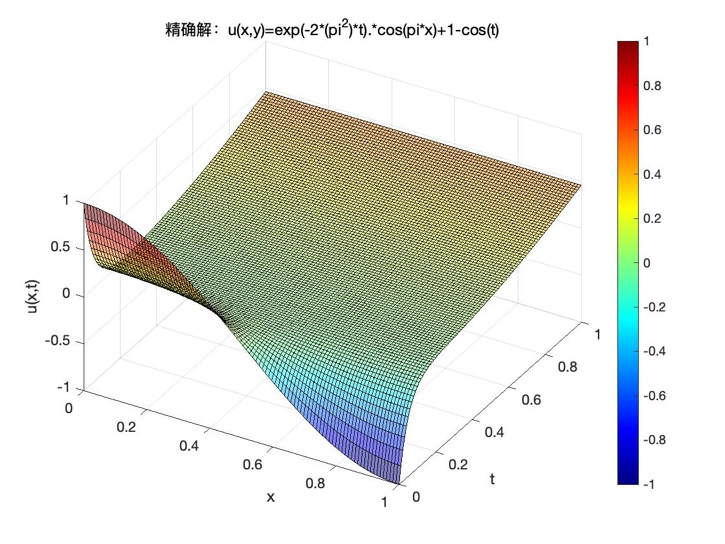 | 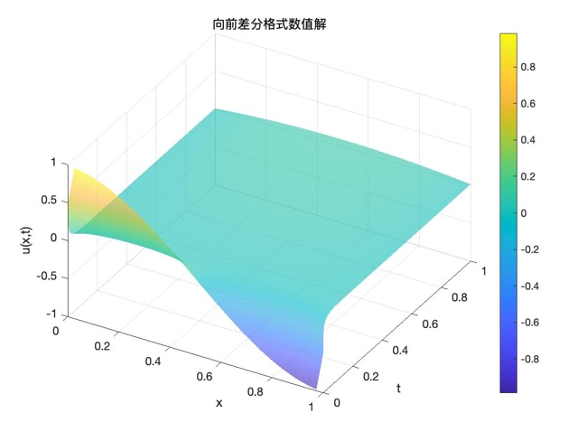 |
|                                                                                                    |                                                                                                |
| 图 3-1 精确解三维图像                                                                              | 图 3-2 $`h = \frac{1}{40},\ \tau = \frac{1}{3200}`$时的向前差分格式                              |

由图3-1和图3-2的可视化，该向前差分数值解与精确解趋势大致一致，说明数值解计算准确。

| 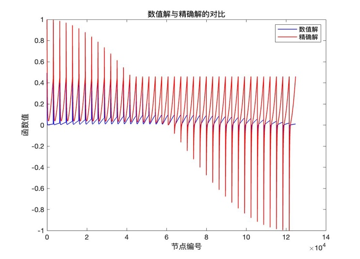 |
|                                                                                                   |
| 图 3-3 $`h = \frac{1}{40},\ \tau = \frac{1}{3200}`$时的数值解与精确解对比                           |

观察图3-3，数值解和精确解大致重合，在t为0附近重合度高，随着t的增大误差变大，出现非物理振荡且差距显著扩大。向前差分格式的稳定性条件为$`r \leq 0.5`$,此时格式虽理论稳定，但实际计算中微小误差（如舍入误差、边界条件扰动）会被放大，导致后期误差积累。

3.1.2 $`h = \frac{1}{80},\ \tau = \frac{1}{3200}`$的向前差分格式

|  | 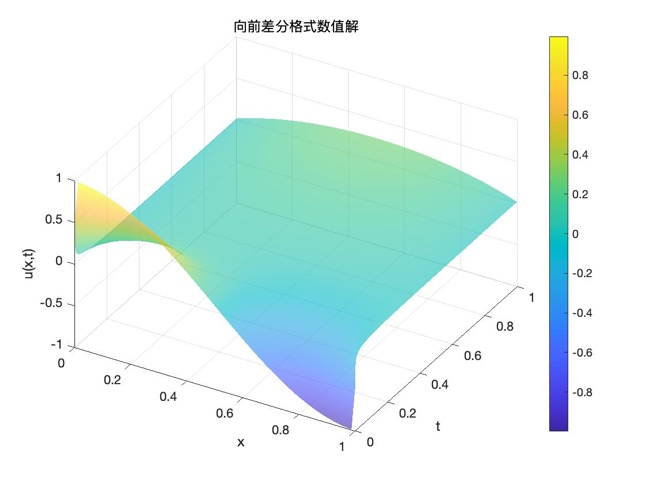 |
|                                                                                                  |                                                                                                  |
| 图 3-4 $`h = \frac{1}{40},\ \tau = \frac{1}{3200}`$时的向前差分格式                                | 图 3-5 $`h = \frac{1}{80},\ \tau = \frac{1}{3200}`$时的向前差分格式                                |

对比图3-4和图3-5，发现减小x的步长，得到的数值解图像变得更加圆滑，可能说明拟合效果更好。接下来用函数值对比观察数值解的误差。

| 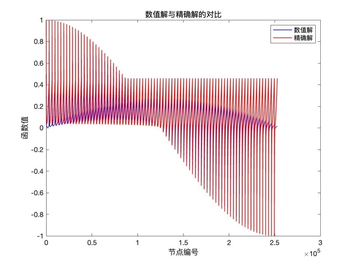 |
|                                                                                                   |
| 图 3-6 $`h = \frac{1}{80},\ \tau = \frac{1}{3200}`$时的数值解与精确解对比                           |

对比图3-6和图3-3，当步长减小时，数值解与精确解对比图总体变得更加紧密，重合度更高，难以观察细微差距。较小的空间步长可以显著提高数值解的精度和稳定性，减少误差和振荡现象，较大的空间步长虽然降低了计算成本，但可能导致数值解的误差和不稳定性增加。

**3.2** **Grank-Nicolson格式**

3.2.1 $`h = \frac{1}{40},\ \tau = \frac{1}{3200}`$的Grank-Nicolson格式

|  |  |
|                                                                                                    |                                                                                                   |
| 图 3-7 精确解三维图像                                                                              | 图 3-8 $`h = \frac{1}{40},\ \tau = \frac{1}{3200}`$的Grank-Nicolson格式                             |

由图3-7和图3-8的可视化，该向前差分数值解与精确解趋势大致一致，说明数值解计算准确。

|  | 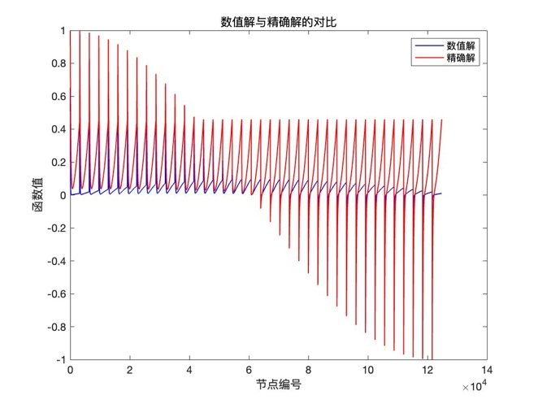 |
|                                                                                                    |                                                                                                    |
| 图 3-9 $`h = \frac{1}{40},\ \tau = \frac{1}{3200}`$时的数值解与精确解对比                            | 图 3-10 $`h = \frac{1}{40},\ \tau = \frac{1}{3200}`$时的误差绝对值                                   |

误差绝对值整体较小，尤其在数值解与精确解波动频繁的区域（如节点编号2×10⁴到14×10⁴），误差绝对值大多在0.5以下，显示出较高的求解精度。

在函数值变化剧烈的区域（如节点编号0到2×10⁴），误差绝对值略有增大，但最大误差仍在可接受范围内。

3.2.2 $`h = \frac{1}{80},\ \tau = \frac{1}{3200}`$的Grank-Nicolson格式

| 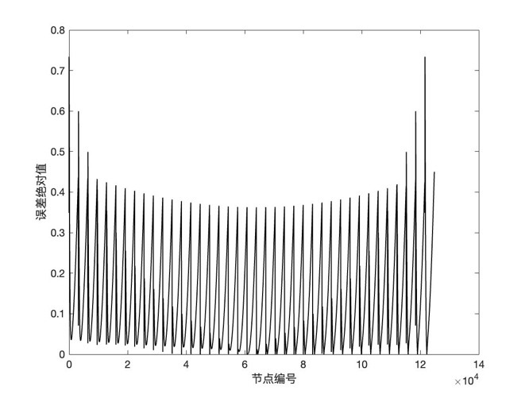 | 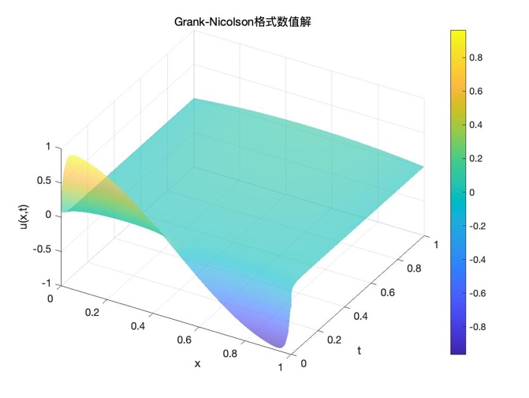 |
|                                                                                                   |                                                                                                  |
| 图 3-11 $`h = \frac{1}{40},\ \tau = \frac{1}{3200}`$的Grank-Nicolson格式                            | 图 3-12 $`h = \frac{1}{80},\ \tau = \frac{1}{3200}`$的Grank-Nicolson格式                           |

步长变小对Grank-Nicolson格式的影响看上去不大，主要是因为该格式具有无条件稳定性和较高的精度。即使步长减小，数值解的精度提升有限，且整体趋势保持一致。

|  | 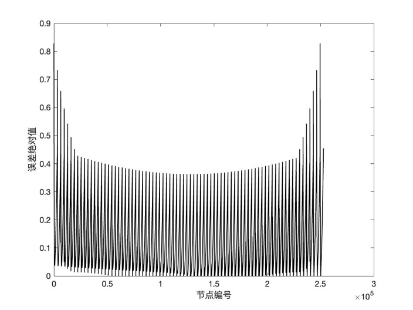 |
|                                                                                                    |                                                                                                   |
| 图 3-9 $`h = \frac{1}{80},\ \tau = \frac{1}{3200}`$时的数值解与精确解对比                            | 图 3-10 $`h = \frac{1}{80},\ \tau = \frac{1}{3200}`$时的误差绝对值                                  |

从误差绝对值来看，步长减小，误差并没有显著减小。当空间步长 *h* 减小到一定程度时，误差可能会趋于饱和，即误差不再显著减小。这可能是由于其他误差来源（如时间步长的误差）开始主导。即使空间步长减小，误差在时间积分过程中可能会累积。由于时间步长相对较大，累积误差可能掩盖了空间步长减小带来的误差减少。

# 总结

**向前差分格式**：

从实验结果可以看出，数值解与精确解整体趋势一致，但在时间推进过程中误差逐渐增大，且在一定条件下会出现非物理振荡现象。这表明向前差分格式的稳定性条件较为苛刻，当步长比不满足稳定性条件时，误差会被放大。

**Grank-Nicolson格式**：

数值解整体趋势与精确解非常接近，在不同步长下都能保持较好的稳定性和精度，误差绝对值整体较小。这归因于其无条件稳定性和二阶精度。当步长减小时，数值解的精度有所提升，但在一定范围内变化不大。原因可能是当空间步长减小到一定程度时，误差主要来源于时间步长，或误差趋于饱和。

通过本次实验，深刻体会到不同数值方法的特点和适用场景。向前差分格式简单易实现，但在稳定性和精度上受限较大；Grank-Nicolson格式虽实现稍复杂，但其高精度和无条件稳定性使其在求解抛物型方程时更具优势。

**实验四 双曲型方程的数值解法**

# 实验试题

分别用显式和隐式差分格式求下列波动方程混合边值问题的数值解：


其精确解为.

要求：

1.  比较时在处两种方法得到的数值解；

2.  比较 时在处两种方法得到的数值解。

# 试题分析及求解过程

**2.1 显式格式**

对于波动方程的初边值问题


```math
\begin{cases}
\frac{\partial^{2}u}{\partial t^{2}} = a\frac{\partial^{2}u}{\partial x^{2}} + f(x,t),\ \ 0 < x < 1,t > 0, 
u(x,0) = \varphi(x),\ \ 0 < x < 1, 
u(0,t) = \alpha(t),u(1,t) = \beta(t),\ \ 0 \leq t \leq T.
\end{cases}
```


将求解区域


```math
\Omega = \left\{ (x,y) \mid 0 \leq x \leq 1,0 \leq t \leq T \right\},
```


作剖分。将区间$`[ 0,l]`$作$`m`$等分，将区间$`[ 0,T]`$作n等分，记


```math
\begin{aligned}
h = \frac{1}{m},\ \ x_{i} = ih,\ (0 \leq i \leq m), \\
\tau = \frac{T}{n},\ \ t_{k} = k\tau,(0 \leq k \leq n),
\end{aligned}
```


分别称$`h`$和$`\tau`$为空间步长和时间步长。

将（4.3）作显式格式：


```math
\begin{cases}
\frac{u_{i,k - 1} - 2u_{i,k} + u_{i,k + 1}}{\tau^{2}} = a\frac{u_{i - 1,k} - 2u_{i,k} + u_{i + 1,k}}{h^{2}} + f_{i,k},\  
u_{i,0} = \varphi\left( x_{i} \right), 
u_{0,k} = \alpha\left( t_{k} \right),\ \ u_{m,k} = \beta\left( t_{k} \right).
\end{cases}
```


其中$`i = 1,2,\ldots,m - 1,\ k = 1,2,\ldots,n.`$

令$`r = a\frac{\tau}{h}`$，将（4.5）改写为线性方程组


```math
\begin{aligned}
u_{i,k + 1} = r^{2}u_{i - 1,k} + 2\left( 1 - 2r^{2} \right)u_{i,k} + r^{2}u_{i + 1,k} - u_{i,k - 1} + {\tau^{2}f}_{i,k}, \\
1 \leq i \leq m - 1,\ \ 1 \leq k \leq n - 1.
\end{aligned}
```


记


```math
u_{k} = \begin{bmatrix}
u_{1,k} 
u_{2,k} 
\begin{matrix}
 \vdots 
\begin{matrix}
u_{m - 2,k} 
u_{m - 1,k}
\end{matrix}
\end{matrix}
\end{bmatrix},\ \ f_{k} = \begin{bmatrix}
\tau^{2}f_{1,k} + r^{2}u_{0,k} 
\tau^{2}f_{2,k}\ \ \ \ \ \ \ \ \ \ \ \ \ \ \ \ \ \  
\begin{matrix}
 \vdots \ \ \ \ \ \ \ \ \ \ \ \ \ \ \ \ \ \  
\begin{matrix}
{\tau^{2}f}_{m - 2,k}\ \ \ \ \ \ \ \ \ \ \ \ \ \ \ \ \ \ \  
\tau^{2}f_{m - 1,k} + r^{2}\varphi_{m,k}
\end{matrix}
\end{matrix}
\end{bmatrix},
```


```math
R = \begin{bmatrix}
2\left( 1 - 2r^{2} \right)\ \ \ \ r^{2}\ \ \ \ \ \ \ \ \ \ \ \ \ \ \ \ \ \ \ \ \ \ \ \ \ \ \ \ \ \ \ \ \ \ \ \ \ \ \ \ \ \ \ \ \ \ \ \ \ \ \ \ \ \ \ \ \ \ \ \ \ \ \ \  
r^{2}\ \ \ \ \ 2\left( 1 - 2r^{2} \right)\ \ \ \ r^{2}\ \ \ \ \ \ \ \ \ \ \ \ \ \ \ \ \ \ \ \ \ \ \ \ \ \ \ \ \ \ \ \ \ \ \ \ \ \ \ \ \ \  
\begin{matrix}
\ \ \ \ \ \ \ \ \ \ \ \ \ \ \  \ddots \ \ \ \ \ \ \ \ \ \ \ \  \ddots \ \ \ \ \ \ \ \ \ \  \ddots \ \ \ \ \ \ \ \ \ \ \ \ \ \ \ \ \ \  
\ \ \ \ \ \ \ \ \ \ \ \ \ \ \ \ \ \ \ \ \ \ \ \ \ \ \ \ \ \ \ \ \ \ \ \ \ \ \ \ \ \ \ \ \ r^{2}\ \ \ \ \ 2\left( 1 - 2r^{2} \right)\ \ \ \ r^{2} 
\ \ \ \ \ \ \ \ \ \ \ \ \ \ \ \ \ \ \ \ \ \ \ \ \ \ \ \ \ \ \ \ \ \ \ \ \ \ \ \ \ \ \ \ \ \ \ \ \ \ \ \ \ \ \ \ \ \ \ \ \ \ \ \ \ \ r^{2}\ \ \ \ \ 2\left( 1 - 2r^{2} \right)
\end{matrix}
\end{bmatrix}.
```


则（4.6）可以写成


```math
Iu_{k - 1} - Ru_{k} + Iu_{k + 1} = f_{k},\ \ 1 \leq k \leq n - 1.
```


其中$`I`$表示单位矩阵，进一步写成矩阵形式：


```math
\begin{bmatrix}
 - R\ \ \ I\ \ \ \ \ \ \ \ \ \ \ \ \ \ \ \ \ \ \ \ \ \ \  
I - R\ \ \ I\ \ \ \ \ \ \ \ \ \ \ \ \ \ \ \ \  
\begin{matrix}
\  \ddots \ \ \  \ddots \ \ \  \ddots 
\ \ \ \ \ \ \ \ \ \ \ \ \ \ \ \ \ \ \ I\  - R\ \ \ I 
\ \ \ \ \ \ \ \ \ \ \ \ \ \ \ \ \ \ \ \ \ \ \ \ \ I - R
\end{matrix}
\end{bmatrix}\begin{bmatrix}
u_{1} 
u_{2} 
\begin{matrix}
 \vdots 
u_{n - 2} 
u_{n - 1}
\end{matrix}
\end{bmatrix} = \begin{bmatrix}
f_{1} - u_{0} 
f_{2}\ \ \ \ \ \ \ \ \  
\begin{matrix}
 \vdots \ \ \ \ \ \ \ \ \  
f_{n - 2}\ \ \ \ \ \ \ \ \  
f_{n - 1} - u_{n}
\end{matrix}
\end{bmatrix}.
```


**2.2 隐式格式**

将（4.3）作隐式格式：


```math
\frac{u_{i,k - 1} - 2u_{i,k} + u_{i,k + 1}}{\tau^{2}} = a^{2}\left[ \begin{aligned} \theta\frac{u_{i - 1,k - 1} - 2u_{i,k - 1} + u_{i + 1,k - 1}}{h^{2}} 
 + (1 - 2\theta)\frac{u_{i - 1,k} - 2u_{i,k} + u_{i + 1,k}}{h^{2}} 
 + \theta\frac{u_{i - 1,k + 1} - 2u_{i,k + 1} + u_{i + 1,k + 1}}{h^{2}} \end{aligned} \right] + f_{i,k},
```


其中$`0 \leq \theta \leq 1,`$当$`\theta = 0`$时为显格式.

考虑$`\theta = \frac{1}{2}`$的情况，得到隐式差分格式


```math
\frac{u_{i,k - 1} - 2u_{i,k} + u_{i,k + 1}}{\tau^{2}} = \frac{a^{2}}{2}\left[ \begin{aligned} \frac{u_{i - 1,k - 1} - 2u_{i,k - 1} + u_{i + 1,k - 1}}{h^{2}} 
 + \frac{u_{i - 1,k + 1} - 2u_{i,k + 1} + u_{i + 1,k + 1}}{h^{2}} \end{aligned} \right] + f_{i,k},
```


令$`r = a\frac{\tau}{h}`$，将（4.12）改写为线性方程组


```math
\begin{aligned}
- ({\frac{1}{2}r}^{2}u_{i - 1,k + 1} - \left( 1 + r^{2} \right)u_{i,k + 1} + \frac{1}{2}r^{2}u_{i + 1,k + 1}) \\
 = {\frac{1}{2}r}^{2}u_{i - 1,k - 1} - \left( 1 + r^{2} \right)u_{i,k - 1} + \frac{1}{2}r^{2}u_{i + 1,k - 1} + 2u_{i,k} + {\tau^{2}f}_{i,k}, \\
1 \leq i \leq m - 1,\ \ 1 \leq k \leq n - 1.
\end{aligned}
```


记


```math
u_{k} = \begin{bmatrix}
u_{1,k} 
u_{2,k} 
\begin{matrix}
 \vdots 
\begin{matrix}
u_{m - 2,k} 
u_{m - 1,k}
\end{matrix}
\end{matrix}
\end{bmatrix},\ \ f_{k} = \begin{bmatrix}
{\tau^{2}f}_{1,k} + \frac{r^{2}}{2}{(\varphi}_{0,k - 1} + \varphi_{0,k + 1})\ \ \ \ \ \ \ \ \ \ \ \ \ \ \ \ \ \ \ \ \  
\tau^{2}f_{2,k}\ \ \ \ \ \ \ \ \ \ \ \ \ \ \ \ \ \ \ \ \ \ \ \ \ \ \ \ \ \ \ \ \ \ \ \ \ \ \ \ \ \ \ \ \ \ \ \ \ \ \ \ \ \ \ \ \ \ \ \  
\begin{matrix}
 \vdots \ \ \ \ \ \ \ \ \ \ \ \ \ \ \ \ \ \ \ \ \ \ \ \ \ \ \ \ \ \ \ \ \ \ \ \ \ \ \ \ \ \ \ \ \ \ \ \ \ \ \ \ \ \ \ \ \  
\begin{matrix}
{\tau^{2}f}_{m - 2,k}\ \ \ \ \ \ \ \ \ \ \ \ \ \ \ \ \ \ \ \ \ \ \ \ \ \ \ \ \ \ \ \ \ \ \ \ \ \ \ \ \ \ \ \ \ \ \ \ \ \ \ \ \ \  
\tau^{2}f_{m - 1,k} + \frac{r^{2}}{2}{(\varphi}_{m - 1,k - 1} + \varphi_{m - 1,k + 1})
\end{matrix}
\end{matrix}
\end{bmatrix},
```


```math
R = \begin{bmatrix}
 - (1 + r^{2})\ \ \ \ \frac{r^{2}}{2}\ \ \ \ \ \ \ \ \ \ \ \ \ \ \ \ \ \ \ \ \ \ \ \ \ \ \ \ \ \ \ \ \ \ \ \ \ \ \ \ \ \ \ \ \ \ \ \ \ \ \ \ \ \ \ \ \ \ \ \ \ \ \  
\frac{r^{2}}{2}\ \ \ \  - (1 + r^{2})\ \ \ \ \frac{r^{2}}{2}\ \ \ \ \ \ \ \ \ \ \ \ \ \ \ \ \ \ \ \ \ \ \ \ \ \ \ \ \ \ \ \ \ \ \ \ \ \ \ \ \  
\begin{matrix}
\ \ \ \ \ \ \ \ \ \ \ \ \ \ \  \ddots \ \ \ \ \ \ \ \ \ \ \ \  \ddots \ \ \ \ \ \ \ \ \ \  \ddots \ \ \ \ \ \ \ \ \ \ \ \ \ \ \ \ \ \  
\ \ \ \ \ \ \ \ \ \ \ \ \ \ \ \ \ \ \ \ \ \ \ \ \ \ \ \ \ \ \ \ \ \ \ \ \ \ \ \ \ \ \ \ \ \frac{r^{2}}{2}\ \ \ \ \  - (1 + r^{2})\ \ \ \ \frac{r^{2}}{2} 
\ \ \ \ \ \ \ \ \ \ \ \ \ \ \ \ \ \ \ \ \ \ \ \ \ \ \ \ \ \ \ \ \ \ \ \ \ \ \ \ \ \ \ \ \ \ \ \ \ \ \ \ \ \ \ \ \ \ \ \ \ \ \ \ \ \frac{r^{2}}{2}\ \ \ \ \  - (1 + r^{2})
\end{matrix}
\end{bmatrix}.
```


则（3.13）可以写成


```math
- Ru_{k - 1} - 2Iu_{k} + {Ru}_{k + 1} = f_{k},\ \ 1 \leq k \leq n - 1.
```


其中$`I`$表示单位矩阵，进一步写成矩阵形式：


```math
\begin{bmatrix}
 - 2I\ \ \ R\ \ \ \ \ \ \ \ \ \ \ \ \ \ \ \ \ \ \ \ \ \ \  
 - R - 2I\ \ \ R\ \ \ \ \ \ \ \ \ \ \ \ \ \ \ \  
\begin{matrix}
\  \ddots \ \ \  \ddots \ \ \  \ddots 
\ \ \ \ \ \ \ \ \ \ \ \ \ \ \ \ \ \  - R\  - 2I\ \ \ R 
\ \ \ \ \ \ \ \ \ \ \ \ \ \ \ \ \ \ \ \ \ \ \ \ \  - R - 2I
\end{matrix}
\end{bmatrix}\begin{bmatrix}
u_{1} 
u_{2} 
\begin{matrix}
 \vdots 
u_{n - 2} 
u_{n - 1}
\end{matrix}
\end{bmatrix} = \begin{bmatrix}
f_{1} + Ru_{0} 
f_{2}\ \ \ \ \ \ \ \ \  
\begin{matrix}
 \vdots \ \ \ \ \ \ \ \ \  
f_{n - 2}\ \ \ \ \ \ \ \ \  
f_{n - 1} - Ru_{n}
\end{matrix}
\end{bmatrix}.
```


# 实验结果及分析

**3.1****的数值解**

该双曲型方程的精确解如下图所示：

| 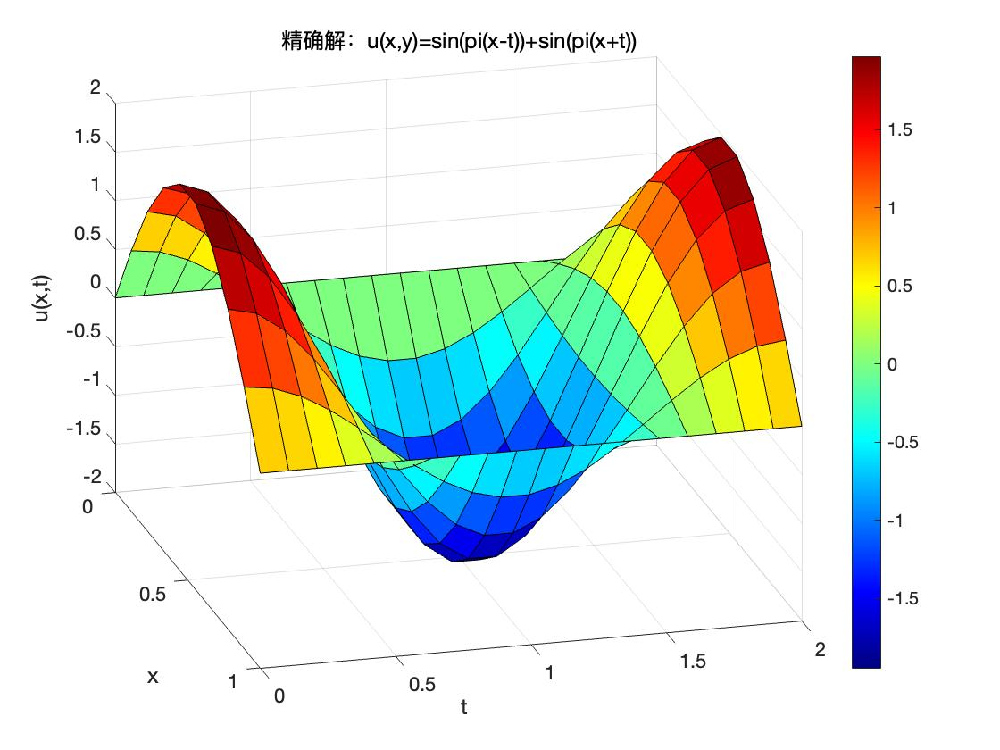 |
|                                                                                                  |
| 图 4-1 精确解图像                                                                                |

显式和隐式数值解分别为图4-2和图4-3,数值解与精确解的对比分别为图4-4和图4-5：

|            |  |
|                                                                                                  |                                                                                                  |
| 图 4-2**时的显式数值解**                                    | 图 4-3 **时的隐式数值解**                                   |
|  | 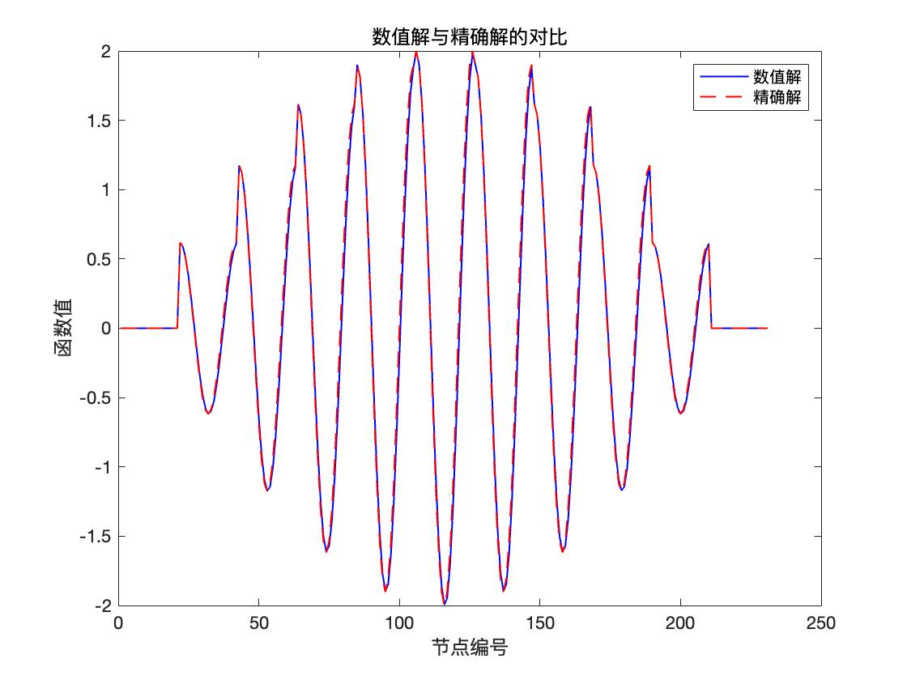  |
|                                                                                                  |                                                                                                  |
| 图 4-4**显式数值解与精确解对比**                                                                 | 图 4-5**隐式数值解与精确解对比**                                                                 |

图片难以观察出显式和隐式数值解的精确度和差别，接下来选取指定时间点的数值作对比，当时，分别对应k=5，10，15，20时的精确解和数值解：

  -------------------------------------------------------------
        0.5             1             1.5              2
  --------------- -------------- -------------- ---------------
         0              0              0               0

    0.190983006    -0.58778525    -0.19098301     0.587785252

    0.363271264    -1.11803399    -0.36327126     1.118033989

        0.5        -1.53884177        -0.5        1.538841769

    0.587785252    -1.80901699    -0.58778525     1.809016994

    0.618033989    -1.90211303    -0.61803399     1.902113033

    0.587785252    -1.80901699    -0.58778525     1.809016994

        0.5        -1.53884177        -0.5        1.538841769

    0.363271264    -1.11803399    -0.36327126     1.118033989

    0.190983006    -0.58778525    -0.19098301     0.587785252
  -------------------------------------------------------------

  : 表 4-1 ,时的精确解

| 表 4-2显式数值解                                      | 表 4-3 隐式数值解                                     |
|                                                       |                                                       |
|   --------------------------------------------------- |   --------------------------------------------------- |
|      t=0.5         t=1         t=1.5         t=2      |      t=0.5         t=1         t=1.5         t=2      |
|   ------------ ------------ ------------ ------------ |   ------------ ------------ ------------ ------------ |
|        0         0.00E+00        0            0       |        0            0            0            0       |
|                                                       |                                                       |
|    0.19098301   -5.88E-01    -0.190983    0.58778525  |    0.20632477   -0.5744637   -0.2492632   0.55583245  |
|                                                       |                                                       |
|    0.36327126   -1.12E+00    -0.3632713   1.11803399  |    0.39245304   -1.0926949   -0.4741268   1.05725615  |
|                                                       |                                                       |
|       0.5       -1.54E+00       -0.5      1.53884177  |    0.54016527   -1.5039655   -0.6525796   1.45518825  |
|                                                       |                                                       |
|    0.58778525   -1.81E+00    -0.5877853   1.80901699  |    0.63500235   -1.7680175   -0.7671533   1.71067639  |
|                                                       |                                                       |
|    0.61803399   -1.90E+00    -0.618034    1.90211303  |    0.66768099   -1.8590036   -0.8066327   1.7987116   |
|                                                       |                                                       |
|    0.58778525   -1.81E+00    -0.5877853   1.80901699  |    0.63500235   -1.7680175   -0.7671533   1.71067639  |
|                                                       |                                                       |
|       0.5       -1.54E+00       -0.5      1.53884177  |    0.54016527   -1.5039655   -0.6525796   1.45518825  |
|                                                       |                                                       |
|    0.36327126   -1.12E+00    -0.3632713   1.11803399  |    0.39245304   -1.0926949   -0.4741268   1.05725615  |
|                                                       |                                                       |
|    0.19098301   -0.5877853   -0.190983    0.58778525  |    0.20632477   -0.5744637   -0.2492632   0.55583245  |
|   --------------------------------------------------- |   --------------------------------------------------- |

分别对比显式数值解和精确解，隐式数值解和精确解，发现显式数值解更加接近精确解的值。再计算每个数值解与精确解的误差的绝对值的总和，以此验证两种差分格式的精确度。

显式数值解的误差总和：1.4766e-14，

隐式数值解的误差总和：2.4293，

显式差分格式的误差接近于0，总误差优于隐式差分格式。

**3.2****的数值解**

此时的显式和隐式数值解分别为图4-6和图4-7，数值解与精确解的对比分别为图4-8和图4-9：

| 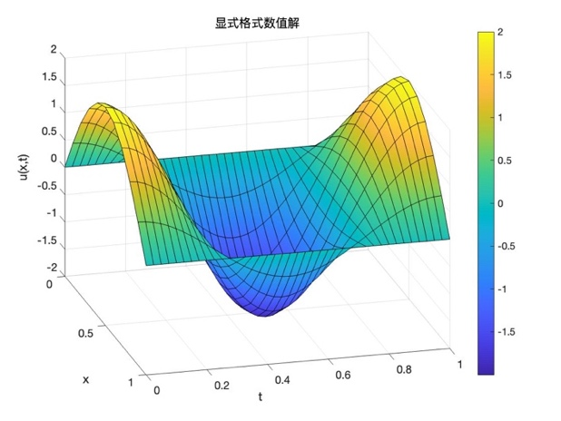   |  |
|                                                                                                    |                                                                                                   |
| 图 4-6**时的显式数值解**                                      | 图4-7 **时的隐式数值解**                                     |
| 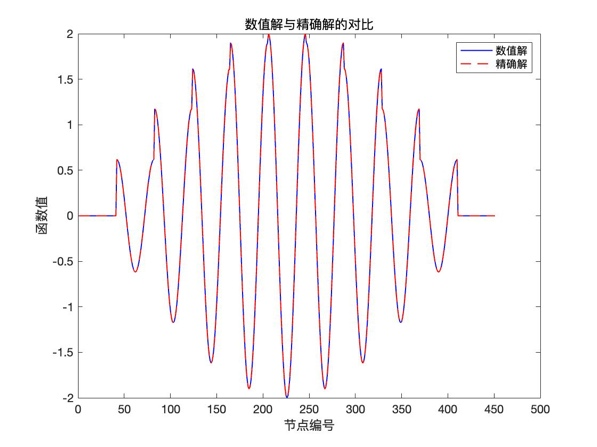 | 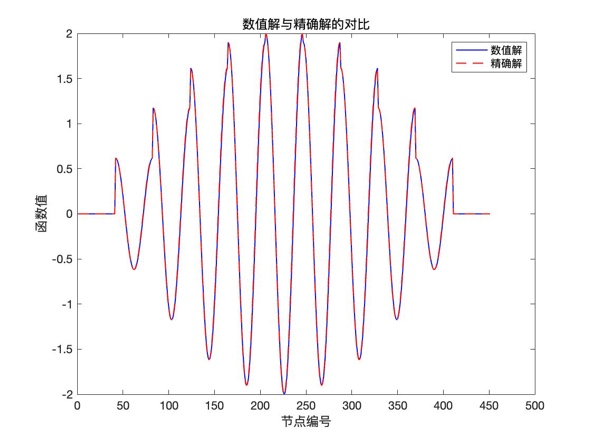               |
|                                                                                                    |                                                                                                   |
| 图 4-8**显式数值解与精确解对比**                                                                   | 图4-9**隐式数值解与精确解对比**                                                                   |

当时，分别对应k=10，20，30，40时的精确解和数值解：

  ---------------------------------------------------------------------------------
          0.5                   1                  1.5                   2
  -------------------- ------------------- -------------------- -------------------
           0                    0                   0                    0

   0.0966818164067699   -0.61042496477978   -0.096681816406770   0.610424964779777

   0.183899743001820    -1.16109728092609   -0.183899743001821   1.16109728092609

   0.253116281447001    -1.59811330537492   -0.253116281447001   1.59811330537492

   0.297556034699316    -1.87869486478351   -0.297556034699317   1.87869486478351

   0.312868930080462    -1.97537668119028   -0.312868930080462   1.97537668119028

   0.297556034699316    -1.87869486478351   -0.297556034699317   1.87869486478351

   0.253116281447001    -1.59811330537492   -0.253116281447001   1.59811330537492

   0.183899743001820    -1.16109728092609   -0.183899743001821   1.16109728092609

   0.0966818164067700   -0.61042496477978   -0.096681816406770   0.610424964779777
  ---------------------------------------------------------------------------------

  : 表 4-4,时的精确解

  ----------------------------------------------------------------------------------
         t=0.5                 t=1                 t=1.5                 t=2
  -------------------- -------------------- -------------------- -------------------
           0                    0                    0                    0

   0.0993465862996154   -0.609507714242681   -0.105261440081330   0.608486224255951

   0.188968436543856    -1.15935256672533    -0.200219157007920   1.15740957730891

   0.260092739598668    -1.59571191229260    -0.275578027837683   1.59303761678817

   0.305757353128887    -1.87587185790602    -0.323961401237668   1.87272803499047

   0.321492306598105    -1.97240839609983    -0.340633175512705   1.96910278506444

   0.305757353128887    -1.87587185790602    -0.323961401237668   1.87272803499047

   0.260092739598668    -1.59571191229260    -0.275578027837680   1.59303761678817

   0.188968436543856    -1.15935256672533    -0.200219157007921   1.15740957730891

   0.0993465862996155   -0.609507714242682   -0.105261440081330   0.608486224255950
  ----------------------------------------------------------------------------------

  : 表 4-5 ,时的显式数值解

  ---------------------------------------------------------------------------------
         t=0.5                t=1                 t=1.5                 t=2
  ------------------- -------------------- -------------------- -------------------
           0                   0                    0                    0

   0.104276435945456   -0.607612934907704   -0.121732263545762   0.604115745687775

   0.198345567803919   -1.15574848225839    -0.231548524977110   1.14909643306573

   0.272999253530905   -1.59075131559245    -0.318699203490263   1.58159555534958

   0.320929870224640   -1.87004032674018    -0.374653383457868   1.85927708505161

   0.337445635170898   -1.96627676136949    -0.393933879889000   1.95495961932361

   0.320929870224642   -1.87004032674018    -0.374653383457865   1.85927708505161

   0.272999253530907   -1.59075131559245    -0.318699203490260   1.58159555534958

   0.198345567803922   -1.15574848225839    -0.231548524977109   1.14909643306573

   0.104276435945458   -0.607612934907706   -0.121732263545761   0.604115745687774
  ---------------------------------------------------------------------------------

  : 表 4-6 ,时的隐式数值解

显式数值解的误差总和：0.2881，

隐式数值解的误差总和：0.8534，

因此，在这种步长情况下，显式总误差小于隐式总误差。

# 总结

**显式与隐式格式的对比：**

显式格式在两种步长下（*τ*=0.1 和 *τ*=0.05）的数值解总误差均显著小于隐式格式。当*τ*=0.1时，显式总误差为 1.4766×10−14（接近机器精度），隐式总误差为2.4293。当*τ*=0.05时，显式总误差为 0.2881，隐式总误差为0.8534。显式格式的误差随步长减小而进一步降低，表现出更高的数值精度。

**显式误差更小的合理性分析：**

**理论依据**：显式格式在波动方程中当满足稳定性条件*r* ≤1时，数值解可能保持精确性。当*τ*=0.1,*h*=0.1时，*r*=1，显式格式无数值耗散，与精确解完全吻合（误差趋近于零），而隐式格式因引入数值扩散或色散，误差更大。

**步长影响**：当 *τ*=0.05 时，*r*=0.5，显式仍满足稳定性条件，且时间步长更小，误差进一步减小。隐式因截断误差特性，精度未显著提升。隐式格式虽无条件稳定，但在此特定问题中因数值特性导致精度较低。

## MATLAB Source Files

The implementations are organized by problem class (filenames only; source code is in the linked directories):

- **`ODE/`** — `Adams_2.m`, `h1h2Adams.m`, `ladder_adams.m`
- **`Parabolic/`** — `Chasing3.m`, `GrankNicolsonParabolic.m`, `paowu.m`, `paowu_GN.m`, `paowu_xiangqian.m`, `testParabolic.m`
- **`Elliptic/`** — `tuoyuan.m`, `tuoyuan_5point.m`
- **`Hyperbolic/`** — `Chasing.m`, `Chasing3.m`, `Hyperbolic2.m`, `shuangqu.m`, `shuangqu_xian.m`, `testHyperbolic.m`, `testHyperbolic2.m`

## License

Released under the MIT License. See `LICENSE`.
